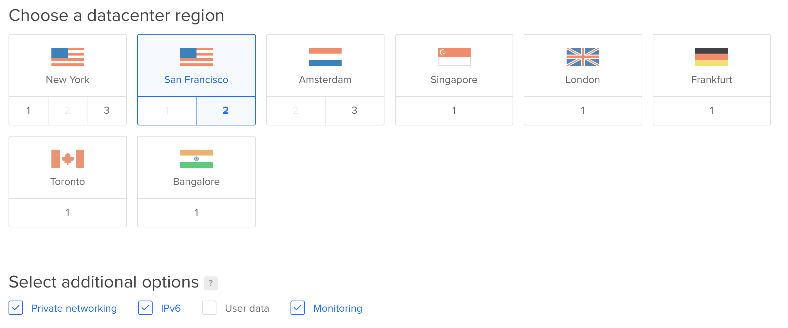

# Github教育优惠使用之VPS

## Github教育优惠申请 
首先，注册一个[github账号](github.com)

然后在[github education](https://education.github.com/students)上进行学生认证，认证后点击Get your Pack即可


申请成功后，可以看到一堆的优惠包


## VPS
​        虚拟专用服务器（Virtual Private Server），是将一台服务器分区成多个虚拟专享服务器的服务。实现VPS的技术分为容器技术和虚拟化技术 。在容器或虚拟机中，每个VPS都可分配独立公网IP地址、独立操作系统、实现不同VPS间磁盘空间、内存、CPU资源、进程和系统配置的隔离，为用户和应用程序模拟出“独占”使用计算资源的体验。VPS可以像独立服务器一样，重装操作系统，安装程序，单独重启服务器。VPS为用户提供了管理配置的自由，可用于企业虚拟化，也可以用于IDC资源租用。 IDC资源租用，由VPS提供商提供。不同VPS提供商所使用的硬件VPS软件的差异，及销售策略的不同，VPS的使用体验也有较大差异。尤其是VPS提供商超卖，导致实体服务器超负荷时，VPS性能将受到极大影响。相对来说，容器技术比虚拟机技术硬件使用效率更高，更易于超卖，所以一般来说容器VPS的价格都高于虚拟机VPS的价格。 这些VPS主机以最大化的效率共享硬件、软件许可证以及管理资源。每个VPS主机都可分配独立公网IP地址、独立操作系统、独立超大空间、独立内存、独立CPU资源、独立执行程序和独立系统配置等. VPS主机用户除了可以分配多个虚拟主机及无限企业邮箱外，更具有独立主机功能, 可自行安装程序，单独重启主机。  
​        VPS本质上是一个服务器，可通过在上面搭载科学上网的代理软件(shadowsocks等)来实现科学上网。VPS首先必须要能够连接互联网，国外的服务器是可以直接上外网的。  

## DigitalOcean
​      在github学生优惠里，可以看到一个DigitalOcean的$50代金券，足够免费使用DO的服务器10个月的时间。 
DigitalOcean的使用方法如下：

### (1)注册DigitalOcean帐号
访问[DigitalOcean](https://m.do.co/c/f102147ffdd1)注册账号(使用此链接注册能得到$10的代金券)

### (2)激活
注册后，需要进行激活。激活有两种方式，一种是绑定信用卡，另一种是用paypal，都要交$5才能激活。推荐使用paypal，可以先注册一个[paypal](http://paypal.com)账号，绑定银行卡，充值​$5后再解绑。  

### (3)兑换优惠码
在 Settings 里面的 Billing 会有一个兑换优惠码的地方。输入github教育优惠页面的DigitalOcean那里的优惠码即可。
若是没有找到兑换优惠码的地方，先联系[客服](https://do-support.force.com/s/createticket)
如图:  


### (4)购买服务器
在DigitalOcean中服务器被称为Droplets，首先选择Create Droplets, 按如下配置即可
  
   
操作系统建议选Centos，版本就选择最新的就可以了，Centos是服务器系统的首选了，Ubuntu比较适合个人使用，在稳定性上Ubuntu不如Centos。关于节点的选择，San Francisco到大陆的网速很快，选择该节点最优。  
SSHKey不是强制的，推荐配置一下，不然每次远程登录时都需要输入密码（这个密码会在服务器搭建完成后收到的邮件中，如果配置的SSH key就不会收到密码），点击New SSH key，得到如下：  
将自己电脑上的ssh公钥复制到上面输入框中，在下面的输入框中为其起一个名字即可。  

- 获取电脑ssh公钥的方法

```shell
ssh-keygen # 然后按三次Enter
cat ～/.ssh/id_rsa.pub
```
复制文件id_rsa.pub的全部内容即可。  

### (5)配置服务器
#### 连接
在自己电脑上进行配置，首先，打开系统的终端或者cmd，使用ssh远程连接服务器。
```shell
ssh root@ip
```
#### 配置防火墙
```shell
# 安装firewalld
yum install firewalld firewall-config
# 启动firewalld
systemctl start firewalld
# 修改SSH端口
vi /usr/lib/firewalld/services/ssh.xml
```
此时出现
```xml
<?xml version="1.0" encoding="utf-8"?>
　　<service>
　　　　<short>SSH</short>
   　　<description>Secure Shell (SSH) is a protocol for logging into and executing commands on remote machines. It provides secure encrypted communications. If you plan on accessing your machine remotely via SSH over a firewalled interface， enable this option. You need the openssh-server package installed for this option to be useful.</description>
   　　<port protocol="tcp" port="22"/>
　　</service>
```
修改port="22"改为 port="xxx"即可。

修改后重载firewalld
```shell
firewall-cmd --permanent --add-service=ssh
firewall-cmd --reload
```
#### 使用[v2ray](./v2ray.sh)安装
##### 安装
```shell
bash v2ray.sh
sudo vi /etc/v2ray/config.json
```
##### 修改配置文件

```json
{
  "inbounds": [
    {
      // 端口
      "port": 443,   
      "protocol": "shadowsocks",
      "settings": {
        // 加密方式
        "method": "aes-256-gcm",
        "ota": false,
        // 密码
        "password": "password"
      }
    }
  ],
  "outbounds": [
    {
      "protocol": "freedom",  
      "settings": {}
    }
  ]
}
```

##### 启动v2ray

```
sudo systemctl start v2ray
```

##### 查看v2ray工作状态

```
sudo systemctl status v2ray
```

如果显示如下所示说明v2ray已经成功启动：

```shell
● v2ray.service - V2Ray Service
   Loaded: loaded (/etc/systemd/system/v2ray.service; enabled; vendor preset: disabled)
   Active: active (running) since Tue 2018-12-18 11:15:33 EST; 1 day 19h ago
 Main PID: 2986 (v2ray)
   CGroup: /system.slice/v2ray.service
           └─2986 /usr/bin/v2ray/v2ray -config /etc/v2ray/config.json

Dec 18 11:15:33 xxxx systemd[1]: Started V2Ray Service.
Dec 18 11:15:34 xxxx v2ray[2986]: V2Ray 4.8.0 (Po) 20181206
Dec 18 11:15:34 xxxx v2ray[2986]: A unified platform for anti-censorship.
Dec 18 11:15:34 xxxx v2ray[2986]: 2018/12/18 11:15:34 [Warning] v2ray.com/core: V2Ray 4.8.0 started
```

然后就可以在自己的客户端上输入对应的参数开始


#### 防火墙添加shadowsocks端口

```shell
firewall-cmd --add-port=8798/tcp --permanent
```
这里要注意的是端口号8798要修改成上面配置文件中的端口号


